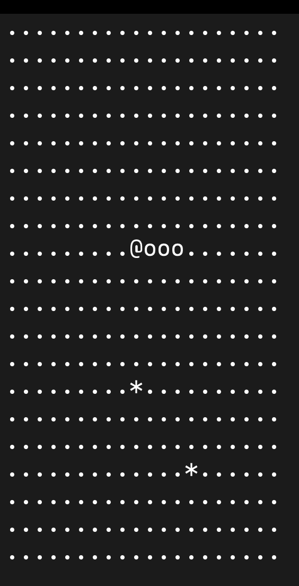

# Snake 

A simple terminal-based Snake game built in C++.
This is my first C++ project. This project helped me practice game loops, real time input, vectors, random spawning and collision detection. 

## Demo


## Features
- Automatic snake movement
- Small, medium and large maps
- Food spawning and snake growth
- Wall and body collision detection
- Win condition if snake fills the entire board

## Requirements 
- C++17 compiler
- Make
- ncurses
- Terminal large enough to display it

## Build & Run 
```bash
make 
make run
```
## Controls 
- `W` - move up
- `A` - move left
- `S` - move down
- `D` - move right

## Future Improvements 
- Add score 
- Add pause/restart
- Add colors 
- Save high scores